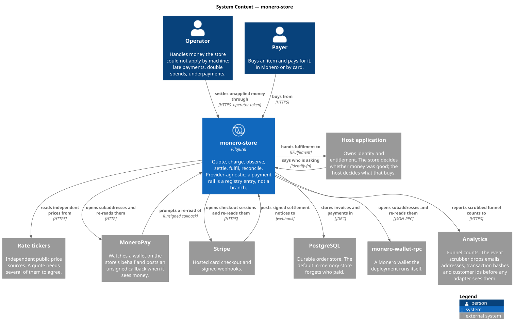

# monero-store-template

A white-label payment application. Monero-first, provider-agnostic: the money
path — quote, charge, observe, settle, fulfil, reconcile — is written once
against ports, and a payment rail is a registry entry rather than a branch.

Ships with four rails (a chain rail over MoneroPay or monero-wallet-rpc, a
hosted-checkout rail with a Stripe reader, an operator-asserted manual rail,
and fakes for all of them), a ClojureScript storefront, and a REPL you can
drive the whole thing from without a daemon, a processor account, or a coin.

```
clojure -M:nrepl   # then (go) — a live store on :8080, every rail faked
bb ui:watch        # the storefront, compiled into what that store serves
bb tokens          # tokens.edn -> the stylesheets
bb test            # 101 tests here, plus design-forge’s own 35
code cljs e2e run  # nine Playwright scenarios against the running store
bb arch            # models/*.edn -> the C4 diagrams under docs/diagrams
```

## Documentation

| | |
|---|---|
| **[Architecture](docs/architecture.md)** | the strata, the ports, and what may depend on what |
| **[The money path](docs/money-path.md)** | quote → charge → observe → settle → fulfil, and every invariant that holds it together |
| **[Integrations](docs/integrations.md)** | every external system, how it is configured, and how far it is trusted |
| **[Adding a rail](docs/rails.md)** | a reader as data, or `IPaymentRail` directly — and what does not change either way |
| **[Embedding it](docs/embedding.md)** | the coordinate, the seams a host supplies, and what the store refuses to decide |
| **[Testing](docs/testing.md)** | contracts, synthesized properties, mutation — and why a pass count is not a mutation score |
| **[Operations](docs/operations.md)** | configuration, the operator queue, reconciliation, reachability |
| **[The model](docs/models.md)** | the architecture as data, and how the diagrams are generated |



## What it is for

You are selling something and want to be paid in Monero — and, because not
everyone will, in something else too. This is that layer, with the parts that
are genuinely hard already decided:

- **A quote is a refusal-first operation.** Fiat is the price truth; a crypto
  amount exists only as a quote from several independent tickers that agree,
  locked for one invoice and one window. Too few sources, a spread past the
  band, a stale reading, or an implied rate outside the pair's sanity bounds
  all produce *no quote*, and no invoice is written.
- **A settlement notice is never evidence.** For a chain rail it is a prompt to
  re-read the wallet; for a processor it must carry a signature over the exact
  bytes that arrived. The invoice — never the caller — selects the rail that
  authenticates the notice.
- **Money buys exactly one period.** The pending → paid transition is a
  compare-and-set, and only the caller that performs it hands anything over.
  Redelivered webhooks, a poll racing a webhook, and a retry after a crash all
  converge on one fulfilment.
- **Money is never swallowed.** A payment against an invoice that was already
  paid or has lapsed is recorded and surfaced to an operator as `:settle/late`,
  because a chain payment has no reversal primitive.

## Layout

Stratified as collect → promote → pipeline → boundary; every layer depends only
downward.

| Layer | Namespace | What lives there |
|---|---|---|
| **collect** | `collect.store` | `IOrderStore` + in-memory adapter. Owns the two invariants above. |
| | `collect.wallet` | `IChainWallet` + MoneroPay adapter + fake. Callback-token HMAC. |
| | `collect.cards` | `ICardGateway` + fake. |
| | `collect.rates` | `IRateSource` + public tickers described as data. |
| | `collect.fulfilment` | `IFulfilment` — the seam your application implements. |
| | `collect.http` | Outbound HTTP as a port, so adapters test with a map. |
| **promote** | `promote.catalog` | What is for sale, as a registry. |
| | `promote.quote` | Consensus, spread, staleness, conversion, sanity bounds. Pure. |
| | `promote.invoice` | What an invoice's own state means. Pure. |
| **payments** | `payments.provider` | `IPaymentRail`, the registry, and `settle` — the decision, read off a profile. |
| | `payments.chain` | The address rail. Any `IChainWallet`. |
| | `payments.hosted` | The hosted-checkout rail. Processor differences are a *reader*, supplied as data. |
| | `payments.stripe` | One reader + signature verification. No SDK needed to authenticate a notice. |
| | `payments.manual` | Operator-asserted grants. No HTTP surface at all. |
| **pipeline** | `pipeline.checkout` | `open!`, `settle!`, `grant!`. |
| | `pipeline.notice` | Who may settle an invoice by posting to the store. |
| | `pipeline.reconcile` | The sweep. A webhook that was never delivered is not a lost sale. |
| **boundary** | `boundary.routes` | The HTTP surface, thin. |
| | `boundary.wire` | The only namespace that decides what leaves the process. |
| | `boundary.identity` | Who is asking — a seam, not a decision. |
| | `boundary.shell` | The SPA document, and the one attribute the server writes into it. |
| | `system` | Reads the environment, wires the rails, serves. |
| **design** | `design.theme` | The storefront's stylesheet, as data. The rest of the pipeline is [design-forge][design-forge]. |

SDK-backed adapters live on their own source roots behind their own aliases, so
a deployment pays only for the rails it runs:

```
adapters/monero-rpc  :monero-rpc   monero-java, for a wallet you run yourself
adapters/stripe      :stripe       stripe-java, for opening hosted checkouts
adapters/jdbc        :jdbc         next.jdbc + postgres, for a real order store
```

`system` resolves them with `requiring-resolve`; a build without the alias logs
what it could not register and starts anyway.

## Every function states its contract

Each of the 206 functions in `src/` carries an `m/=>` schema, and the suite
INSTRUMENTS them: `monero-store.contract-test` calls `malli.instrument/instrument!`
at load, so every other test in the suite runs against enforced contracts. A
schema that lies about its own function fails the build rather than decorating
it — four did when instrumentation was first switched on, and the schemas were
the things that were wrong.

The same namespace guards the coverage itself: a new `defn` with no contract
fails `every-function-in-the-store-declares-its-contract`, so the spine cannot
quietly decay.

The tests below it are not hand-written cases. [hive-schemas][hive-schemas]
synthesizes the generator, the oracle and the mutants from the same schemas the
contracts are written in, and [hive-test][hive-test] supplies the mutation
engine — so `settlement-of` is checked against every corruption of the
`Settlement` schema, which is what makes that schema a specification instead of
a description.

The sums are [hive-dsl][hive-dsl]'s `defadt`: one declaration yields the
constructor (which refuses an undeclared variant), the predicate, an
exhaustive `adt-case` checked at macro-expansion time, and the ADT's own malli
schema.

[hive-dsl]: https://github.com/hive-agi/hive-dsl
[hive-schemas]: https://github.com/hive-agi/hive-schemas
[hive-test]: https://github.com/hive-agi/hive-test

## Embedding it

Two ways in. Clone this repository when you want the whole thing — storefront,
stylesheet pipeline, adapters — as the starting point for one store. Depend on
the coordinate when you already have an application and want its money path:

```clojure
io.github.buddhilw/monero-store {:mvn/version "0.3.0"}
```

That jar is `src` and `resources` only: the money path, its ports, and zero
payment-SDK dependencies. Every SDK-backed adapter stays on its own source root
in this repository, so a consumer brings its own — or copies one. `clojure -T:build
install` puts it in `~/.m2`.

The store never authenticates anyone and never decides what a sale entitles
someone to. Both are yours:

```clojure
(require '[monero-store.system :as system]
         '[monero-store.collect.fulfilment :as fulfilment])

(system/start!
 {:identify-fn (fn [request]                       ; your OIDC, session, API key
                 (when-let [user (my-auth/user-of request)]
                   {:customer/ref (:id user) :customer/email (:email user)}))

  :fulfilment  (fulfilment/handler                 ; must be idempotent
                (fn [{:fulfilment/keys [customer-id item-id period-end]}]
                  (my-app/grant! customer-id item-id period-end)))

  :catalog     [{:item/id :pro
                 :item/name "Pro"
                 :item/price {:money/amount 9900 :money/currency :usd :money/scale 2}
                 :item/period :yearly}]})
```

`:store`, `:rails`, and `:rates-fn` are overridable the same way — pass a
`provider/registry` of your own to register a rail this template has never
heard of.

### Adding a payment provider

A processor with a hosted checkout is a **reader** (data) plus a gateway
adapter — look at `payments/stripe.clj`, which is about sixty lines of
substance:

```clojure
{:reader/settled-events #{"payment.succeeded"}
 :reader/failed-events  #{"payment.expired"}
 :reader/subject-key    :our_reference
 :reader/object-id-key  :id
 :reader/amount-keys    [:amount]
 :reader/authentic?     (fn [notice] ...)}   ; the whole authentication boundary
```

Anything else — a second chain, an invoice-by-email rail — implements
`IPaymentRail` directly and declares a `ProviderProfile`. Nothing in `settle`,
the pipeline, or the boundary changes: the profile carries the thresholds and
the registry carries the rail.

## The stylesheet is generated, not written

`resources/public/css/*.css` are build artifacts. The source is `tokens.edn`
(what the colours are) and `design/theme.clj` (what the layout is); `bb tokens`
turns them into CSS through [design-forge][design-forge], which renders with
[garden][garden].

The pipeline itself is a separate library — this project owns only the
contract, the rules, and `design-forge.edn` saying where the output goes.
design-forge is not on Clojars yet, so the `:design` alias names its **git
coordinate** — a cold clone of this repo builds its own stylesheets with no
local checkout and no untracked override file. Nothing under `src/` requires
it: `system` resolves the token reader lazily, so a cold `clojure -M:test`
never fetches it at all, and a deployment that ships the generated CSS without
the pipeline still boots. This repository is the worked example in
[design-forge's own README][design-forge-example], which documents the wiring
step by step.

```
tokens.edn ──► resolve aliases ──► WCAG contrast gate ──► garden ──► tokens.css
                                          │                         store.css
design/theme.clj ─────────────────────────┘                         tokens.cljs
```

Three properties are worth the pipeline:

- **A rule cannot name a colour.** Values in `theme.clj` are roles —
  `[:token "color.surface"]` — and a role that does not exist fails the build.
  Rebranding is editing `tokens.edn`; it is never grepping for hex codes. A
  test asserts that no rule contains a literal colour, so this stays true.
- **Contrast is a build gate, not a hope.** Every pair declared under
  `:contrast` is measured in every scheme — and so is every experiment arm.
  A combination below its minimum fails the build and *nothing is written*.
  `bb tokens:report` prints the table.
- **A scheme states only its overrides.** Dark mode re-declares the twenty
  roles that differ, inherits the rest, and is emitted twice: behind
  `prefers-color-scheme` and behind `[data-theme]`, so a toggle beats the
  operating system without either being maintained by hand.

`bb tokens:check` fails if the committed CSS has drifted from its source; the
test suite runs the same check, so a hand-edited stylesheet shows up as a
failing test rather than as a mystery three weeks later.

The token file follows the same contract as a `tokens.json` published for other
applications, so `TOKENS_FILE` can point at one you already have instead of
forking this one.

> Garden runs on the JVM only — its records implement `clojure.lang.IFn`, which
> SCI rejects — so `bb tokens` shells out to `clojure -M:design`. Babashka is
> the task runner here, not the runtime.

## Experiments and analytics

An A/B test is part of the *token contract*, not a script:

```clojure
:experiments
{:cta-color {:attribute "data-store-cta"
             :target "semantic.color.accent"
             :contrast-with "semantic.color.accent-foreground"
             :minimum 4.5
             :variants {:brand {:default "{color.brand.700}" :dark "{color.brand.400}"}
                        :deep  {:default "{color.brand.800}" :dark "{color.brand.300}"}}}}
```

Every arm ships in the stylesheet as one attribute selector. The server assigns
a visitor by hashing their id (sticky, storage-free, and identical across
processes), merges `data-store-cta` into the shell's `<html>` attributes, and
records the assignment **on the invoice** — so a settlement that arrives from a
webhook three days later still lands against the arm that produced it.

The shell is hiccup (`boundary/shell`), not a template file: assigning an arm
is `merge` on a map. It was briefly a regex over an HTML document, which
rewrote a comment that mentioned `<html>` and shipped every visitor the control
arm — a broken experiment that looks exactly like a working one. Data
structures do not have that failure mode, and the test asserts on the data
rather than on rendered output.

Because the arms are tokens, they are contrast-checked like everything else: an
experiment cannot ship a variant nobody can read.

Measurement is the same shape as everything else here — a port:

```clojure
(defprotocol IAnalytics (track! [this event]))
```

with a no-op (the default), a logger, an in-memory recorder for tests, and an
[Umami][umami] adapter — self-hostable, because the funnel of a Monero store
does not belong to an advertising network. Events carry counts, never people:
`analytics/scrub` drops emails, addresses, transaction hashes and customer ids
before an adapter ever sees them, and a value it does not recognise becomes its
type name rather than its contents.

[garden]: https://github.com/noprompt/garden
[design-forge]: https://github.com/BuddhiLW/design-forge
[design-forge-example]: https://github.com/BuddhiLW/design-forge#a-project-that-uses-it
[umami]: https://umami.is

## Configuration

| Variable | Default | Meaning |
|---|---|---|
| `PORT` | `8080` | HTTP port |
| `PUBLIC_BASE_URL` | `http://localhost:8080` | Base for callback URLs |
| `ADMIN_TOKEN` | *unset* | Operator surface. Unset means no operator surface. |
| `IDENTITY` | `none` | `header` trusts `x-customer-ref` outright — demo, or behind a gateway that already authenticated the caller |
| `CATALOG_FILE` | *unset* | EDN vector of items; the sample catalog otherwise |
| `STORE_BACKEND` | `memory` | `memory` or `jdbc` |
| `DATABASE_URL` / `DATABASE_USER` / `DATABASE_PASSWORD` | | for `jdbc` |
| `FULFILMENT` | `ledger` | `ledger`, `log`, or `none` |
| `MONERO_BACKEND` | `none` | `moneropay`, `wallet-rpc`, or `fake` |
| `MONEROPAY_URL` | `http://moneropay:5000` | |
| `MONERO_CALLBACK_SECRET` | *unset* | HMAC key for the token in the callback URL |
| `MONERO_MIN_CONFIRMATIONS` | `10` | |
| `MONERO_WALLET_RPC_URI` / `_USERNAME` / `_PASSWORD` | | for `wallet-rpc` |
| `CARDS_BACKEND` | `none` | `stripe` or `fake` |
| `STRIPE_API_KEY` / `STRIPE_WEBHOOK_SECRET` | | Stripe without the webhook secret refuses every notice and settles by polling |
| `RECONCILE_INTERVAL_MS` | `60000` | |
| `RATE_CACHE_TTL_MS` | `60000` | |
| `REACHABILITY_TIMEOUT_MS` | `2000` | Per-endpoint connect timeout for the readiness probe |
| `TOKENS_FILE` | `tokens.edn` | Design contract; experiments are read from it |
| `ANALYTICS` | `none` | `umami`, `log`, or `none` |
| `UMAMI_URL` / `UMAMI_WEBSITE_ID` | | for `umami` |

## HTTP surface

```
GET  /api/catalog              items, live quotes per rail currency, rails
POST /api/checkout             {item, provider} -> invoice + how to pay
GET  /api/invoices/:id         the caller's own invoice only
GET  /api/me/invoices          invoices + what has been granted
POST /webhooks/:provider                     processor names the invoice in the body
POST /webhooks/:provider/:invoice            rail names it in the path
POST /webhooks/:provider/:invoice/:token     ... with a callback token
GET  /api/admin/queue          money seen but not applied, open invoices, rate feed
POST /api/admin/grants         {customer, item, reference} — operator grant
GET  /api/admin/reachability   can this store still reach what it settles through
GET  /healthz                  the process is up. Nothing more than that
```

### Liveness and readiness are different questions

`/healthz` proves a JVM is accepting connections. It touches no wallet, no
database and no processor, so it answers `200` straight through an outage in
any of them — which is correct for a container health check and useless for
an operator.

`/api/admin/reachability` opens a TCP connection to every service this
deployment is configured to reach and reports what happened, per service:

```json
{"ok": false, "checked": 2, "unreachable": 1,
 "endpoints": [{"label": "moneropay", "host": "moneropay", "port": 5000,
                "outcome": "refused", "elapsed-ms": 3, "detail": "Connection refused"},
               {"label": "database", "host": "postgres", "port": 5432,
                "outcome": "open", "elapsed-ms": 1, "detail": null}]}
```

`200` when everything answered, `503` when something did not. A refusal and a
timeout stay distinct: a service that said no is not a path that never
answered, and only the second one is usually a firewall.

The list is **derived**, never restated — `system/endpoints` reads the same
config keys the adapters are built from, so moving `MONEROPAY_URL` moves the
probe with it, and a rail that is not configured is not probed. An empty list
reports `ok: true` with `checked: 0`, which is what a deployment that reaches
nothing over the network honestly is.

The same question as a command, for an operator who would otherwise reach for
`telnet`:

```
$ bb reach
moneropay    moneropay:5000   refused          3ms  Connection refused
database     postgres:5432    open             1ms
```

Exit `1` when anything is unreachable, so it composes into a deploy gate.

## Development

`dev/user.clj` boots a store with every rail faked and drives it:

```clojure
(go)                     ; http://localhost:8080
(def opened (buy! :pro)) ; open an invoice on the chain rail
(pay! opened 1/2)        ; money arrives
(sweep!)                 ; => {:settle/underpaid 1}
(pay! opened 1/2)
(sweep!)                 ; => {:settle/grant 1}
(granted)
(reset)                  ; reload changed namespaces and boot again
```

## Deploying

`docker compose up` brings up postgres, MoneroPay against a stagenet daemon,
and the store. Read `docker-compose.yml` before pointing it at mainnet — the
wallet it opens is yours, and its keys are on that volume.

## Licence

Use it, change it, sell with it.
