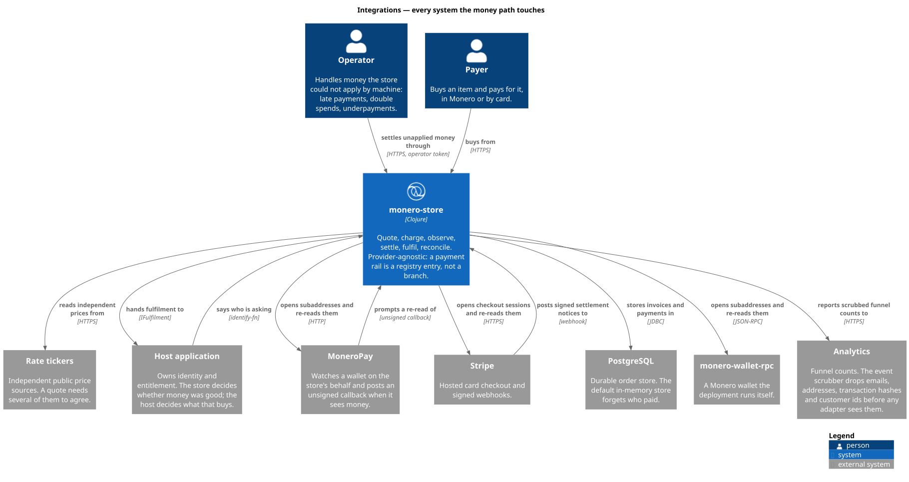

# Integrations

Every system outside this process that the money path touches, and what it takes
to wire one.

Each of them sits behind a protocol declared in `collect/`, and the protocol —
not the vendor — is what the store depends on. That has a consequence worth
stating up front: **every integration on this page is optional**. The store
boots with none of them, runs its whole test suite with none of them, and takes
money with a fake wallet. What an absent integration changes is what can be
sold, not whether the process starts.

The one exception is the host application, which is not a service the store
dials at all. It is the process the store runs inside.

## The picture



Source: `docs/diagrams/plantuml/monero-store/integration-view.puml`, and both
it and the picture are build artifacts. The model is
`models/monero-store/model.edn` and `views.edn`; `bb arch` regenerates the
`.puml` from it, and nothing else. The `.svg` embedded here is a second step:
`bb arch:svg` depends on `arch` and then runs `plantuml -tsvg` over the
generated `.puml` files, so it needs plantuml on PATH. `bb arch` alone leaves
the picture above stale. Editing either artifact is editing the wrong file; see
[models.md](models.md).

The arrows in that view are the thing to read, because direction is what the
rest of this page is about:

| Relation | Direction | Transport |
|---|---|---|
| store → MoneroPay | opens subaddresses and re-reads them | HTTP |
| MoneroPay → store | prompts a re-read of | unsigned callback |
| store → monero-wallet-rpc | opens subaddresses and re-reads them | JSON-RPC |
| store → Stripe | opens checkout sessions and re-reads them | HTTPS |
| Stripe → store | posts signed settlement notices to | webhook |
| store → rate tickers | reads independent prices from | HTTPS |
| store → PostgreSQL | stores invoices and payments in | JDBC |
| store → analytics | reports scrubbed funnel counts to | HTTPS |
| store → host application | hands fulfilment to | `IFulfilment` |
| host application → store | says who is asking | `identify-fn` |
| payer → store | buys from | HTTPS |
| operator → store | settles unapplied money through | HTTPS, operator token |

Five arrows point inward, and only two of them are the trust problem. A payer
buying and an operator settling unapplied money under `ADMIN_TOKEN` are the
store's own HTTP surface being used as intended; the host application saying who
is asking is a function call, not a request. What is left is the two settlement
notices, arriving from a system the store does not control — and they are
answered very differently.

## At a glance

| System | Port | Selected by | Alias | When it is absent |
|---|---|---|---|---|
| MoneroPay | `IChainWallet` | `MONERO_BACKEND=moneropay` | none | no chain rail is registered |
| monero-wallet-rpc | `IChainWallet` | `MONERO_BACKEND=wallet-rpc` | `:monero-rpc` | warns, no chain rail is registered |
| Stripe | `ICardGateway` | `CARDS_BACKEND=stripe` | `:stripe` | warns, no card rail is registered |
| Rate tickers | `IRateSource` | always on | none | the round yields nothing and is not cached |
| PostgreSQL | `IOrderStore` | `STORE_BACKEND=jdbc` | `:jdbc` | warns, **falls back to memory** |
| Analytics | `IAnalytics` | `ANALYTICS=umami` | none | measures nothing |
| Host application | `IFulfilment`, `identify-fn` | `start!` overrides | none | ledger-plus-log fulfilment, nobody identified |

Two of them degrade rather than refuse: a `jdbc` store with no `:jdbc` alias
falls back to `store/memory-store`, and `ANALYTICS=umami` with no website id
falls back to `analytics/noop`. Both install a working implementation that is
not the one asked for. The rails do the opposite — `chain-wallet` and
`card-gateway` return `nil`, `system/rails` conjoins nothing, and a rail that
cannot settle is never advertised. Of the two that degrade, only the store one
can cost you something, and it is explained in its own section.

---

## MoneroPay

**What it is for.** MoneroPay watches a Monero wallet on the store's behalf. It
assigns one subaddress per expected amount and posts a callback when it sees
money, so the store never runs a wallet daemon itself.

**Port.** `monero-store.collect.wallet/IChainWallet`, satisfied by
`wallet/moneropay-wallet`. Two operations, both plain HTTP against the gateway:

- `open-address!` → `POST {base}/receive` with `{:amount :description :callback_url}`
- `observe` → `GET {base}/receive/{address}`

**Configuration.**

| Variable | Default | Meaning |
|---|---|---|
| `MONERO_BACKEND` | `none` | `moneropay` selects this wallet |
| `MONEROPAY_URL` | `http://moneropay:5000` | the gateway origin |
| `MONERO_CALLBACK_SECRET` | unset | HMAC key for the callback token |
| `MONERO_MIN_CONFIRMATIONS` | `10` | confirmations before the payment settles |
| `MONERO_PROVIDER_ID` | `monero` | how this rail is named in the registry |
| `MONERO_CURRENCY` | `xmr` | the rail's currency |

**Alias.** None. MoneroPay speaks HTTP, and the HTTP client (hato) is a core
dependency. This is why `MONERO_BACKEND=moneropay` needs no extra source root
while `wallet-rpc` does.

**When it is absent or misconfigured.** The shared HTTP client catches
everything and returns `{:http/status 0}` rather than throwing, so an
unreachable gateway is a status, not a stack trace. From there the two
operations diverge on purpose:

- `open-address!` throws `ex-info` with `{:monero-store/error :address-unavailable}`
  when the gateway will not open an address. Checkout fails loudly, because
  handing a customer an invoice with no address to pay is worse than an error.
- `observe` logs `gateway cannot report on address` and returns `nil`. No
  observation is no evidence — the invoice stays open and the reconcile sweep
  tries again on the next `RECONCILE_INTERVAL_MS`.

**Notices.** MoneroPay signs nothing. See [The trust model](#the-trust-model)
below; this is the case the whole design is shaped around.

`MONERO_BACKEND=fake` registers the same chain rail over
`wallet/fake-wallet`, an `IChainWallet` over an atom. `wallet/credit!` appends a
transfer to it, which drives the entire settlement path from a REPL with no
daemon, no gateway and no coin.

## monero-wallet-rpc

**What it is for.** The deployment runs its own Monero wallet and the store
drives it directly, with no gateway in between.

**Port.** The same `IChainWallet`, satisfied by
`monero-store.adapters.monero-rpc/rpc-wallet` over the `monero-java` SDK. The
rail above it is unchanged — a chain rail does not know which of the two wallets
is underneath.

**Configuration.**

| Variable | Default | Meaning |
|---|---|---|
| `MONERO_BACKEND` | `none` | `wallet-rpc` selects this wallet |
| `MONERO_WALLET_RPC_URI` | unset | the RPC endpoint |
| `MONERO_WALLET_RPC_USERNAME` | unset | digest credentials |
| `MONERO_WALLET_RPC_PASSWORD` | unset | digest credentials |
| `MONERO_ACCOUNT_INDEX` | `0` | the account subaddresses are opened under |

`MONERO_MIN_CONFIRMATIONS`, `MONERO_PROVIDER_ID` and `MONERO_CURRENCY` apply
here too — they belong to the rail, not to the wallet.

**Alias.** `:monero-rpc`, which adds `adapters/monero-rpc/src` and
`io.github.woodser/monero-java`. Nothing under `src/` requires that namespace;
`system/optional-fn` resolves it by symbol at wiring time and returns `nil` when
it is not on the classpath. That is how an SDK-backed adapter stays optional
without a compile-time dependency, and why the published library carries no
payment SDK at all.

**When it is absent or misconfigured.**

| Condition | What happens |
|---|---|
| `:monero-rpc` not on the classpath | logs `MONERO_BACKEND=wallet-rpc but the :monero-rpc alias is not on the classpath`, no wallet |
| `MONERO_WALLET_RPC_URI` blank | logs `MONERO_BACKEND=wallet-rpc but MONERO_WALLET_RPC_URI is unset`, no wallet |
| daemon unreachable at boot | nothing — the connection is a `delay`, opened on first use |
| daemon unreachable at observation | logs `wallet cannot observe subaddress`, returns `nil` |

No wallet means no chain rail: `system/rails` only conjoins a chain entry when
`chain-wallet` returned something. A rail that cannot settle is never
advertised.

**Notices.** A wallet does not call back. The chain rail publishes the same
webhook route whichever wallet backs it, so `/webhooks/monero/…` exists — but
with `wallet-rpc` nothing posts to it, and settlement is carried entirely by the
reconcile sweep.

## Stripe

**What it is for.** Hosted card checkout, for a deployment that wants to sell to
people who will not pay in Monero.

**Port.** `monero-store.collect.cards/ICardGateway`, satisfied by
`monero-store.adapters.stripe-cards/stripe-gateway` (`open-checkout!`,
`read-checkout`). The rail is `payments.stripe/entry`, which is
`payments.hosted/entry` with a Stripe profile and a Stripe notice reader.

**Configuration.**

| Variable | Default | Meaning |
|---|---|---|
| `CARDS_BACKEND` | `none` | `stripe` selects this gateway; `fake` selects `cards/fake-gateway` |
| `STRIPE_API_KEY` | unset | decides live or test mode |
| `STRIPE_WEBHOOK_SECRET` | unset | the endpoint signing secret |
| `STRIPE_API_BASE` | unset | points the client elsewhere — a sandbox, or stripe-mock |
| `CARDS_CURRENCY` | `usd` | the rail's currency |

The success and cancel URLs are not separately configurable: they are derived
from `PUBLIC_BASE_URL` as `{base}/paid` and `{base}/`.

**Alias.** `:stripe`, which adds `adapters/stripe/src` and
`com.stripe/stripe-java`. Resolved the same lazy way as `:monero-rpc`.

**When it is absent or misconfigured.**

| Condition | What happens |
|---|---|
| `:stripe` not on the classpath | logs `CARDS_BACKEND=stripe but the :stripe alias is not on the classpath`, no gateway, no card rail |
| `STRIPE_API_KEY` blank | logs `CARDS_BACKEND=stripe but STRIPE_API_KEY is unset`, no gateway, no card rail |
| key unusable | nothing at boot — the client is a `delay`, built on first use |
| Stripe cannot report on a session | logs `card processor cannot report on session`, returns `nil` |
| `STRIPE_WEBHOOK_SECRET` blank | **the rail still registers**, and refuses every notice |

That last row is the one to understand. A configured Stripe with no webhook
secret is not a broken deployment — it is a slower one. The signed fast path is
off, and the polled path carries settlement, because the profile sets
`:provider/settlement-poll? true`.

**Notices.** Stripe signs its payloads. See below.

## The rate tickers

**What it is for.** Pricing. A quote in XMR needs a rate, and a rate from one
exchange is a rate one exchange can be wrong about.

**Port.** `monero-store.collect.rates/IRateSource`. `rates/registry` builds one
source per profile in `rates/sources`, which is four independent public tickers,
none of which needs an account or a key:

| Source | Pair | Endpoint |
|---|---|---|
| `:kraken` | XMR/USD | `api.kraken.com/0/public/Ticker?pair=XMRUSD` |
| `:coingecko` | XMR/USD | `api.coingecko.com/api/v3/simple/price?ids=monero&vs_currencies=usd` |
| `:coinpaprika` | XMR/USD | `api.coinpaprika.com/v1/tickers/xmr-monero` |
| `:bitfinex` | XMR/USD | `api-pub.bitfinex.com/v2/ticker/tXMRUSD` |

**Configuration.**

| Variable | Default | Meaning |
|---|---|---|
| `RATE_CACHE_TTL_MS` | `60000` | at most one round of network per this window |
| `RATE_TIMEOUT_MS` | `10000` | bounds every upstream HTTP call |

`RATE_TIMEOUT_MS` is worth a second look: it configures the single
`http/hato-client` that `start!` builds and then hands to the rate feed, the
MoneroPay wallet and the analytics sink alike. It is named for rates and it
bounds all three.

**Alias.** None.

**When they are absent or misconfigured.** A source that fails is absent from
the round rather than failing it — `rates/round` keeps what answered. A round
that yields nothing is not cached, so a total outage retries on the next call
instead of pinning an empty result for `RATE_CACHE_TTL_MS`. A ticker that quotes
its price as a string is handled; `rates/->number` accepts either.

**Notices.** None, in either direction. The store only ever reads.

## PostgreSQL

**What it is for.** Remembering who paid. The default in-memory store forgets
everything on restart, including that.

**Port.** `monero-store.collect.store/IOrderStore`, satisfied by
`monero-store.adapters.jdbc-store/jdbc-store` over next.jdbc and HikariCP. The
DDL runs at construction.

**Configuration.**

| Variable | Default | Meaning |
|---|---|---|
| `STORE_BACKEND` | `memory` | `jdbc` selects PostgreSQL |
| `DATABASE_URL` | unset | the JDBC URL |
| `DATABASE_USER` | unset | |
| `DATABASE_PASSWORD` | unset | |

Unlike `PORT`, `MONEROPAY_URL` or `TOKENS_FILE`, none of the three `DATABASE_*`
variables carries a fallback in code: `system/config` reads them with the one-argument `env` —
`:jdbc-url (env "DATABASE_URL")` — so unset is `nil`, not a localhost guess. The
familiar `jdbc:postgresql://postgres:5432/store` and `store` do exist, in
`.env.example` and `docker-compose.yml`, but they are the compose deployment's
values rather than the store's. A store run outside compose is told its database
or has none.

**Alias.** `:jdbc`, which adds `adapters/jdbc/src`, next.jdbc, the PostgreSQL
driver and HikariCP.

**When it is absent or misconfigured.** This is the degradation that matters.
With `STORE_BACKEND=jdbc` and no `:jdbc` alias,
the store logs

```
STORE_BACKEND=jdbc but the :jdbc alias is not on the classpath; using memory
```

and boots on `store/memory-store`. The reasoning is that a template which
refuses to boot teaches nothing — but it is the wrong behaviour for a real
deployment, and the log line is the only thing standing between you and a store
that quietly forgets who paid. Treat it as a boot-time assertion in whatever
runs the process.

Failing to *connect* is different from failing to *load*: with the alias present
and the database unreachable, `jdbc-store` builds its datasource and runs the
DDL at construction, so the failure surfaces during `start!`. An unset
`DATABASE_URL` fails the same way rather than falling back — `datasource` hands
HikariCP a `nil` JDBC URL, and the DDL is what discovers it.

**Notices.** None. PostgreSQL is written to, never listened to.

## The analytics sink

**What it is for.** Funnel counts — how many people reached checkout, how many
paid. Not who they were.

**Port.** `monero-store.collect.analytics/IAnalytics`, one method, `track!`.

| `ANALYTICS` | Sink |
|---|---|
| `umami` | `analytics/umami` — posts to `{UMAMI_URL}/api/send` |
| `log` | `analytics/logging` |
| anything else, including unset | `analytics/noop` |

**Configuration.**

| Variable | Default | Meaning |
|---|---|---|
| `ANALYTICS` | `none` | which sink |
| `UMAMI_URL` | unset | the Umami origin |
| `UMAMI_WEBSITE_ID` | unset | the site's uuid |
| `ANALYTICS_HOSTNAME` | `store` | the hostname reported with each event |

**Alias.** None.

**When it is absent or misconfigured.** `ANALYTICS=umami` with a blank
`UMAMI_WEBSITE_ID` logs `ANALYTICS=umami but UMAMI_WEBSITE_ID is unset;
measuring nothing` and installs the noop sink instead. At runtime, a rejected
request is logged and a throwing sink is caught: a customer paying an invoice
does not care that a dashboard is down. `analytics/composite` extends the same
rule to several sinks — one that throws does not stop the others.

Umami rejects a request with no `User-Agent`, so one is always sent.

**What leaves the process.** `analytics/scrub` drops a fixed set of keys before
any adapter sees an event:

```clojure
#{:email :customer :customer-id :address :pay-to :external-ref :reference
  :tx-hash :references :secret :token}
```

An address is a pseudonym until it is joined to anything else; an email or a
transaction hash joined to a funnel event is a deanonymisation waiting to be
queried. The scrubber is also strict about values — an unrecognised type becomes
its class name rather than being passed through, because the failure mode of a
permissive scrubber is silent and permanent.

**Notices.** None inbound.

## The host application

Not a service. The host application is the process this store runs inside, and
it is an integration in the sense that matters most: it owns identity and it
owns entitlement. The store decides whether money was good; the host decides
what that buys.

**How it embeds.** Depend on `io.github.buddhilw/monero-store` (0.3.0) from the
hive-gitea Maven registry — a source jar of `src` and `resources` only, carrying
no payment-SDK dependency — and call `system/start!` with overrides:

| Override | Replaces |
|---|---|
| `:fulfilment` | the `IFulfilment` — hand delivery to the host |
| `:identify-fn` | who is asking |
| `:catalog` | sell the host's own items |
| `:rails` | register a rail this template has never heard of |
| `:store` | persist where the host already persists |
| `:rates-fn` | price from a feed the host already has |
| `:analytics` | measure with the host's own sink |
| `:experiments` | run arms declared somewhere other than the token file |

Anything else in the map is a config key and overrides the environment.

**Identity.** `IDENTITY=header` installs `identity/header-identity`, which
trusts the `x-customer-ref` request header outright. It logs a warning saying
so at boot. That is a demo, or a deployment behind a gateway that has already
authenticated the caller. Any other value resolves nobody, which is the default.
Anything real supplies `:identify-fn` and never touches `IDENTITY` at all.

**The operator surface.** `ADMIN_TOKEN` gates `GET /api/admin/queue` and
`POST /api/admin/grants`. Unset means there is no operator surface, and `start!`
logs `operator surface disabled: ADMIN_TOKEN is unset`.

**Other environment the host controls.**

| Variable | Default | Meaning |
|---|---|---|
| `PORT` | `8080` | |
| `PUBLIC_BASE_URL` | `http://localhost:8080` | the base callbacks and redirects are built from |
| `CATALOG_FILE` | unset | an EDN vector of items; the sample catalog otherwise |
| `FULFILMENT` | ledger + log | `none` or `log` |
| `DISABLE_MANUAL_RAIL` | unset | set to true/1/yes to drop the manual rail |
| `RECONCILE_INTERVAL_MS` | `60000` | how often the sweep runs |
| `TOKENS_FILE` | `tokens.edn` | the design contract experiments are read from |

**Notices.** None — the host is in-process. `IFulfilment` is a function call.

---

## The trust model

Three rails, three different answers to *who authenticated this notice*. The
answer lives in each rail's profile under `:provider/webhook-auth`, and the
routes are the same for all of them:

```
POST /webhooks/:provider
POST /webhooks/:provider/:invoice
POST /webhooks/:provider/:invoice/:token
```

One handler serves all three shapes. Which shape a rail uses changes nothing
about who authenticates the notice — the invoice's own rail always does.

| Rail | `:provider/webhook-auth` | What authenticates a notice |
|---|---|---|
| chain (`:monero`) | `:server-confirmed` | nothing in the body; the store re-reads the wallet |
| Stripe | `:signed-payload` | a v1 HMAC-SHA256 over the exact bytes that arrived |
| manual | `:none` | no notice is accepted at all |

### MoneroPay signs nothing

This is the load-bearing fact. MoneroPay posts a callback with no signature of
any kind, so **the callback body is never evidence here**. It is a prompt to
re-read `/receive/{address}` — which is what `observe` does, and what the rail
settles from. A forged callback can, at most, make the store ask its own wallet
a question it already knew the answer to.

`MONERO_CALLBACK_SECRET` is not a signature check. It is an HMAC-SHA256 over the
invoice id, truncated to 32 hex characters, appended to the callback URL as a
path segment when the rail opens the address:

| Secret | Callback URL | A notice about invoice *i* |
|---|---|---|
| unset | `…/webhooks/monero/{invoice}` | always allowed to prompt a re-read |
| set | `…/webhooks/monero/{invoice}/{token}` | must present the token for *i*, compared in constant time |

With no secret every notice may prompt a re-read, which is harmless because the
answer comes from the wallet either way. With a secret, the token keeps a
stranger from making the store hammer its own wallet. The comparison fails
closed: `wallet/token-valid?` treats a blank secret and a blank presented token
as failures, because a check that fails open is not a check.

### Stripe signs its payloads

`stripe/signature-valid?` requires a `stripe-signature` header carrying a `t`
timestamp and at least one `v1` value, and recomputes HMAC-SHA256 over
`"{t}.{raw body}"` under `STRIPE_WEBHOOK_SECRET`, compared in constant time.

Four things about it are deliberate:

- The **raw body** is signed. Reserializing a parsed body changes bytes and
  every signature over them, so the handler keeps the untouched request body.
- A **blank secret accepts nothing**. An unconfigured endpoint that fails open
  is worse than one that is off.
- The timestamp must fall within `default-tolerance-seconds` (300, Stripe's own
  recommendation) of receipt — **on both sides**. Stripe's tolerance is
  one-sided; this store adds a future bound, because a notice stamped a year
  ahead is not a notice.
- A malformed header is refused, not parsed loosely.

The reader then accepts only known events, and reads the invoice from
`client_reference_id`:

| | Events |
|---|---|
| settled | `checkout.session.completed`, `invoice.payment_succeeded` |
| failed | `checkout.session.expired`, `invoice.payment_failed` |

### The manual rail has no HTTP surface

`manual/profile` sets `:provider/webhook-auth :none`, which makes
`provider/webhook-settleable?` false for it. Its `notice-subject`,
`verify-notice` and `poll` all return `nil`. There is nothing to authenticate
because there is nothing to send: a manual invoice settles through the operator
surface, `POST /api/admin/grants`.

### What a caller is told

`pipeline.notice/apply-notice!` returns one of three verdicts, and the route
maps them:

| Verdict | Status | Body |
|---|---|---|
| `:notice/applied` | 200 | the `SettlementOutcome` variant |
| `:notice/unauthenticated` | 400 | `unauthenticated settlement notice` |
| `:notice/unknown-invoice` | 404 | `unknown invoice` |

`:notice/unknown-invoice` covers three distinct situations — no such invoice,
the claimed provider is not the invoice's own, and that rail admits no
settlement over HTTP. They are collapsed into one verdict on purpose: telling a
stranger which of them it was is telling them what to send next.

---

## Reachability: is the service even there?

`src/monero_store/collect/reachability.clj` answers the question a telnet by
hand answers — but as a value, and with the distinction that matters preserved.
A telnet answers it once, for one person, and leaves nothing behind.

`probe` opens a TCP connection to an `Endpoint` (`:endpoint/host`,
`:endpoint/port`, optional `:endpoint/label`), closes it, and returns a
`ReachabilityReport`:

```clojure
{:reach/label      "moneropay:5000"
 :reach/host       "moneropay"
 :reach/port       5000
 :reach/outcome    <Reachability>
 :reach/elapsed-ms 3
 :reach/detail     nil}
```

It never throws. An unreachable service is a value, because the caller's job is
to report it.

The outcome is a `Reachability`, a closed sum with five variants. What a probe
throws decides which:

| Variant | Thrown | What it means operationally |
|---|---|---|
| `:reach/open` | nothing | the connection was accepted and closed |
| `:reach/refused` | `ConnectException` | **something answered.** The route works; nothing is listening on that port |
| `:reach/timeout` | `SocketTimeoutException` | **nothing answered.** The path is blocked |
| `:reach/unknown-host` | `UnknownHostException` | the name never resolved; nothing was dialled |
| `:reach/error` | anything else | kept distinct rather than folded into a refusal |

### Why a refusal and a timeout are not the same failure

They look identical from the application's side — no connection either way — and
they call for opposite responses.

A **refusal** is an answer. A packet reached the host, the host's TCP stack
replied with RST, and the reply came back. Routing, DNS and firewalls are all
working. What is wrong is at the other end: the service is down, the container
has not started, or the port is wrong. The fix is on the service.

A **timeout** is the absence of an answer. The store cannot tell whether the
packet arrived, whether the service is healthy, or whether anything exists at
that address at all, because nothing came back. That is the signature of a
dropped packet: a firewall rule, a security group, a network the two processes
do not share. The fix is on the path, and restarting the service will not touch
it.

`reachability/blocked?` is exactly this predicate — it is true for
`:reach/timeout` and nothing else. A refusal is a service that is down; a
timeout is a path that never carried the question.

`:reach/unknown-host` separates a third case that is easy to misread as either:
nothing was dialled, because the name did not resolve. In a compose deployment
that usually means a service name that does not match the one in
`docker-compose.yml`, not a network fault.

### Probes

| Constructor | Backing |
|---|---|
| `socket-probe` | a real TCP connect, with a timeout |
| `fake-probe` | a map of `[host port]` → `Throwable`-or-`nil` |

`fake-probe` is what makes the classification testable without a network: the
suite asserts that a refusal and a timeout produce different reports from the
same code path.

Nothing in `system.clj` calls this namespace. It is not on the boot path — it is
a diagnostic, for the moment when settlement has stopped and you need to know
which of the systems on this page is the reason.
