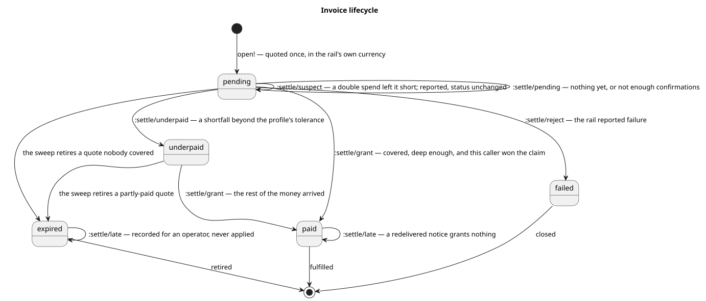

# The money path

What happens to money, from the moment a customer asks the price to the moment
something is handed over. Every function named here is in `src/monero_store/`;
the file and namespace are given so a claim can be checked against the code
rather than believed.

The path is one shape — quote, charge, observe, settle, fulfil — written once
against ports. A payment rail is a registry entry, so nothing below branches on
which rail is in use.

## One payment, end to end

### 1. Quote

`POST /api/checkout` reaches `boundary.routes/checkout-handler`. It resolves the
caller, refuses an unknown item, refuses an unlisted item to anyone who is not
the operator, refuses an unregistered rail, and then calls
`pipeline.checkout/open!`.

`open!` first asks whether this customer already has a live invoice for the same
item and rail. A customer who reloads the checkout page must not accumulate
invoices, so `store/live-invoice-for` plus `invoice/chargeable?` plus
`provider/resumed-handle` hand the existing one back when the rail can still
resume it. Only when there is nothing to resume does a new invoice get priced.

Pricing is `checkout/priced`:

```clojure
(defn- priced
  [{:keys [rates-fn now-fn] :or {now-fn #(Date.)}} item currency]
  (let [stored (catalog/price item)]
    (if (= currency (:money/currency stored))
      {:money stored}
      (if-let [quoted (quotes/quote-for quotes/profile
                                        stored
                                        (if rates-fn (rates-fn) [])
                                        currency
                                        (now-fn))]
        {:money (:quote/amount quoted) :quote quoted}
        (throw (ex-info "no agreed rate for that currency"
                        {:monero-store/error :quote-required
                         :item-id (:item/id item)
                         :stored-currency (:money/currency stored)
                         :requested-currency currency}))))))
```

The stored price is used verbatim in its own currency. Any other currency needs
a live quote, and `promote.quote/quote-for` returns nil when it cannot justify
one. The throw happens before any row is written — see the first invariant
below. `checkout-handler` catches that one `ex-data` key and answers 503
`{"error": "payment provider unavailable"}`.

### 2. Charge

Still inside `open!`, in this order:

1. `UUID/randomUUID` mints the invoice id.
2. `store/insert-invoice!` writes the row at `:invoice/status :pending`, with
   the amount, the currency, and — when the amount came from a quote —
   `:invoice/quoted-rate`, `:invoice/quote-sources` and `:invoice/expires-at`.
   `:variants` is written onto the invoice, not merely reported, because the
   settlement that decides whether an experiment worked can arrive days later
   from a webhook that knows nothing about the browser that started it.
3. `provider/charge!` asks the rail to open a payment, and is handed
   `:charge/callback-url` built as
   `(str callback-base "/webhooks/" (name provider-id) "/" invoice-id)`.
   The id exists before the rail is asked because the callback URL contains it.
4. `store/attach-external-ref!` records the handle's `:handle/external-ref` —
   for the chain rail, the subaddress the customer pays.

A rail never prices an item. It is told an amount, in its own currency, and
opens a payment for it. For `payments.chain/->rail` that means
`wallet/open-address!`, with `wallet/callback-token` appended to the callback
URL when a `:callback-secret` is configured.

### 3. Observe

Two ways money is noticed, both ending in the same wallet read.

| Route in | Chain of calls |
|---|---|
| The sweep | `reconcile/sweep!` → `reconcile/reconcile!` → `provider/polled-settlement` → the rail's `poll` → `chain/observe-settlement` → `chain/settlement-of` |
| A notice | `POST /webhooks/:provider[/:invoice[/:token]]` → `notice/apply-notice!` → `provider/settlement-for` → the rail's `verify-notice` → `chain/notice-authentic?` → `chain/observe-settlement` → `chain/settlement-of` |

`chain/observe-settlement` returns nil when the invoice has no address yet or
the wallet cannot report on it: no observation is no evidence. What it does
return is normalized by `chain/settlement-of`:

```clojure
(let [seen (:wallet/transfers observation)
      transfers (remove :transfer/double-spend? seen)
      counted (reduce + 0 (map :transfer/amount transfers))
      unlocked (:wallet/unlocked-amount observation)
      paid (if (and unlocked (seq transfers)) (min counted (long unlocked)) counted)
      confirmations (if (seq transfers)
                      (apply min (map :transfer/confirmations transfers))
                      0)
      locked? (boolean (some :transfer/locked? transfers))]
  ...)
```

Three decisions live in those bindings. A transfer flagged as a double spend
contributes neither funds nor confirmations, but is remembered in
`:settlement/suspect?`. Confirmations are the weakest contributing transfer's,
not the strongest. And when the wallet reports its own unlocked total, the
smaller of the two wins — a permissive wallet cannot widen the gate.

### 4. Settle

`pipeline.checkout/settle!` is the only place a Settlement is applied.

```clojure
(when (= (:invoice/provider invoice) (:settlement/provider settlement))
  (let [now (now-fn)
        resolution (invoice/resolution invoice now)
        report! ...]
    (record-observation! store invoice settlement resolution)
    (if (= :late resolution)
      (report! (adt/settlement-outcome :settle/late))
      (let [outcome (provider/settle rails settlement)
            item (catalog/item (:invoice/item-id invoice))]
        (adt/adt-case adt/SettlementOutcome outcome
          :settle/grant     (do (hand-over! deps invoice item now) (report! outcome))
          :settle/underpaid (do (store/set-invoice-status! store (:invoice/id invoice) :underpaid) (report! outcome))
          :settle/reject    (do (store/set-invoice-status! store (:invoice/id invoice) :failed) (report! outcome))
          :settle/suspect   (report! outcome)
          :settle/late      (report! outcome)
          :settle/pending   outcome)))))
```

Four things about that form:

- The outer `when` is the rail guard. A Settlement produced by a rail other than
  the invoice's own returns nil and changes nothing.
- `record-observation!` runs first, before the resolution is acted on. Money is
  written to the payment ledger whether or not it can be applied.
- The `:late` decision is taken on `invoice/resolution` alone, before
  `provider/settle` is consulted at all.
- `adt-case` over `adt/SettlementOutcome` is exhaustive, checked when the macro
  expands. A new variant cannot be added to the ADT without this form failing to
  compile.

`payments.provider/settle` is the decision itself, and it is pure. Every
threshold comes from the rail's profile, so a new rail needs no change here. The
order of the clauses is the policy:

| # | Condition | Outcome |
|---|---|---|
| 1 | `:settlement/status` is `:failed` | `:settle/reject` |
| 2 | `suspect?` and the shortfall exceeds `:provider/underpay-tolerance` | `:settle/suspect` |
| 3 | nothing paid | `:settle/pending` |
| 4 | the shortfall exceeds `:provider/underpay-tolerance` | `:settle/underpaid` |
| 5 | confirmations below `:provider/min-confirmations` | `:settle/pending` |
| 6 | `:settlement/status` is `:pending` | `:settle/pending` |
| 7 | otherwise | `:settle/grant` |

`shortfall` is `(- expected-amount paid-amount)`. The chain rail's
`default-profile` sets `:provider/min-confirmations 10` and
`:provider/underpay-tolerance 0` — ten is the depth at which a Monero reorg
stops being a practical concern.

### 5. Fulfil

Only `:settle/grant` reaches `hand-over!`:

```clojure
(if-let [claimed (store/claim-paid! store (:invoice/id invoice))]
  (let [grant (grant-for claimed item now)]
    (try
      (when fulfilment (fulfilment/fulfil! fulfilment grant))
      grant
      (catch Throwable t
        (store/release-claim! store (:invoice/id invoice))
        (log/error t "fulfilment failed; invoice released for retry"
                   {:invoice (:invoice/id invoice)})
        (throw t))))
  nil)
```

`grant-for` builds `{:fulfilment/invoice-id :fulfilment/customer-id
:fulfilment/item-id :fulfilment/period-end}`, where `period-end` adds one
`Calendar/MONTH` or `Calendar/YEAR` to now, or is nil for a one-off. That map is
the whole of what `collect.fulfilment/fulfil!` — the seam an application
implements — is told.

## The invariants

| Invariant | Enforced by | File |
|---|---|---|
| A quote is refusal-first, and no invoice is written without one | `promote.quote/quote-for`, called from `checkout/priced` before `store/insert-invoice!` | `promote/quote.clj`, `pipeline/checkout.clj` |
| Money buys exactly one period | `collect.store/claim-paid!`, a compare-and-set, in `checkout/hand-over!` | `collect/store.clj`, `pipeline/checkout.clj` |
| A fulfilment that throws is retried | the `catch` in `checkout/hand-over!` calling `store/release-claim!` | `pipeline/checkout.clj` |
| Money against a closed or lapsed invoice is never applied | `promote.invoice/resolution`, read by `checkout/settle!` before `provider/settle` | `promote/invoice.clj`, `pipeline/checkout.clj` |
| A double spend leaving a shortfall is suspect, not silence | clause 2 of `payments.provider/settle` | `payments/provider.clj` |
| A notice is never evidence for a chain rail | `chain/->rail`'s `verify-notice`, which re-reads the wallet | `payments/chain.clj` |

### A quote is refusal-first

Four independent reasons produce no quote, and nil is the whole answer:

| Refusal | Where |
|---|---|
| Fewer than `:quote/min-sources` readings survive | `quote/consensus` |
| A reading is older than `:quote/max-age-ms` | `quote/fresh` |
| A reading sits further than `:quote/max-spread-bps` from the median | `quote/agreeing` |
| The implied rate falls outside the pair's declared band | `quote/plausible?` |

`quote/profile` is the whole policy:

```clojure
{:quote/min-sources 2
 :quote/max-spread-bps 500
 :quote/max-age-ms 300000
 :quote/lock-ms 900000}
```

Order matters. `consensus` drops stale readings first, then readings far from
the median, and only then counts what is left:

```clojure
(let [usable (agreeing profile (fresh profile (for-pair rates pair) now))]
  (when (>= (count usable) (long (:quote/min-sources profile)))
    {:rate/price (median (map :rate/price usable))
     :rate/sources (mapv :rate/source usable)}))
```

A reading far from the middle is dropped, never averaged in — so one broken
ticker neither prices the sale nor blocks it. The band checked by `plausible?`
is declared with `quote/set-bounds!` and is a sanity band, not a pricing
opinion: it exists so a ticker that starts reporting in the wrong unit cannot
sell a year of service for a fraction of a cent. A pair with no declared band is
trusted.

The refusal reaches the customer as a 503, and the enforcement point is
positional: `priced` throws inside `open!`'s `let`, before
`store/insert-invoice!` is evaluated. There is no half-written invoice to clean
up, because there is no invoice.

Two smaller decisions live alongside. `quote/convert` rounds with
`RoundingMode/UP` — a rounding error must fall on the store, never leave the
customer a hair short of their own invoice. And the quote's
`:quote/expires-at`, `:quote/lock-ms` after `now`, becomes the invoice's
`:invoice/expires-at`, which is what later makes it lapse.

### Money buys exactly one period

`hand-over!` calls `store/claim-paid!`, whose contract is the invariant:

```clojure
(claim-paid! [this invoice-id]
    "Transition `invoice-id` from pending/underpaid to paid, once.

    Returns the invoice when THIS call performed the transition, nil when it
    was already paid or does not exist. The gate that makes a redelivered
    settlement notice harmless.")
```

Only the caller that performed the transition receives an invoice; every other
caller receives nil and `hand-over!` returns nil without touching
`fulfilment/fulfil!`. A redelivered webhook, a poll racing a webhook, and a
retry after a crash all converge on one fulfilment. The store adapter owns the
atomicity; the pipeline owns only the rule that the winner is the one who
fulfils.

`money-buys-exactly-one-period` in `pipeline/checkout_test.clj` asserts the
whole of it: one grant after the first sweep, `:settle/late` on the redelivery,
still one grant, and still one payment row.

### A fulfilment that throws releases the claim

The `catch Throwable` in `hand-over!` calls `store/release-claim!` and rethrows.
The invoice goes back to being open, so the next `reconcile/sweep!` sees it in
`store/open-invoices` and retries. At-least-once is what a store and a foreign
system can honestly agree on, which is why `IFulfilment/fulfil!` demands
idempotence in its own contract.

The rethrow is caught one level up by `reconcile/reconcile!`, which logs and
returns nil, so one invoice's failure stays its own — a wallet or a licence
server that is briefly unreachable must not stop every other invoice from
settling. `a-failed-fulfilment-releases-the-invoice-for-retry` asserts the
sequence: the first sweep returns `{}` and leaves the invoice `:pending`; the
second returns `{:settle/grant 1}` and leaves it `:paid`.

### Late money is recorded, never applied

`promote.invoice/resolution` is the whole decision:

```clojure
(if (and (open? invoice) (not (lapsed? invoice now)))
  :applied
  :late)
```

`open?` is membership in `store/open-statuses` — `#{:pending :underpaid}` — so a
`:paid`, `:expired` or `:failed` invoice is closed. `lapsed?` compares
`:invoice/expires-at` against now; an invoice that declares no expiry never
lapses, because nothing was promised about a window.

`settle!` reads that resolution before `provider/settle` is called. This is why
a redelivered notice cannot grant a lapsed quote: the `:late` branch is taken on
the invoice's own state, without ever asking what the money means.

The money is not lost. `record-observation!` has already run, and writes
`:payment/resolution :late` onto the payment row, which is what
`store/unapplied-payments` surfaces at `GET /api/admin/queue`. The alternative
is swallowing it, and a chain payment has no reversal primitive to undo that
with. An operator settles it by hand through `checkout/grant!`, which records
`"operator:<reference>"` on the payment so the grant is never unattributable.

`record-observation!` is also the idempotence gate for the ledger. It writes
only when `:settlement/paid-amount` is positive, and names the observation with
`observation-reference` — every transaction hash the rail reported, sorted and
joined. Re-seeing the same money is recognizably the same observation and
`store/record-payment!` returns nil; one new transaction makes a new one.

### A double spend that leaves a shortfall is suspect

Clause 2 of `provider/settle` is `(and suspect? (> shortfall (long
underpay-tolerance)))`. Both halves matter.

`chain/settlement-of` has already excluded double-spent transfers from
`:settlement/paid-amount`, so `suspect?` on its own would say nothing about
whether the customer is short. The conjunction says: report it to an operator
while, and only while, the invoice is still uncovered.

`:settle/suspect` changes no status. The invoice stays open, the outcome is
reported, and the sweep will look again. That is deliberate — the money that did
arrive is never held hostage by money that did not. When a covering payment
arrives alongside the double spend the shortfall is not positive, clause 2 does
not fire, and the settlement falls through to `:settle/grant`.
`a-double-spend-that-leaves-a-shortfall-is-suspect-not-silence` in
`payments/provider_test.clj` pins all four cases, including that a rail
reporting `:failed` still outranks it.

### A settlement notice is never evidence for a chain rail

The chain rail's `verify-notice` is:

```clojure
(verify-notice [_ notice invoice]
  (when (notice-authentic? callback-secret invoice notice)
    (observe-settlement provider-id wallet invoice)))
```

Nothing in `notice` supplies an amount, a confirmation count or a status. The
notice decides only whether the store bothers to look; the answer comes from
`wallet/observe`. With no `:callback-secret` configured every notice is allowed
to prompt a read, which is harmless for exactly that reason. With one, the path
token must match, which keeps a stranger from making the store hammer its own
wallet.

The selection is equally deliberate. `notice/apply-notice!` takes the invoice id
as a *claim*, loads the invoice, and then requires that the invoice's own
provider matches the claimed one and that `provider/webhook-settleable?` holds
for it before `provider/settlement-for` picks the rail that must authenticate.
The invoice selects the authenticator; the caller never does. `IPaymentRail`
marks the distinction in its own docstrings — `interpret` "trusts `payload`
outright. Not an authentication boundary", while `poll` notes that "nothing
prompts this read, so nothing about it can be forged".

`apply-notice!` collapses three failures into one verdict —
`:notice/unknown-invoice`, answered 404 — for no such invoice, a provider that
is not the invoice's own, and a rail that admits no settlement over HTTP at all.
Telling a stranger which of them it was is telling them what to send next.

## The invoice lifecycle



The diagram is generated: `models/monero-store/state.edn` → `bb arch` →
`docs/diagrams/plantuml/monero-store/invoice-lifecycle-view.puml`. Editing the
`.puml` is editing a build artifact.

Every transition out of `:pending` is a SettlementOutcome from
`provider/settle`, except expiry, which is `reconcile/expire-stale!` retiring a
quote nobody covered. The two expiry edges — from `pending` and from
`underpaid` — are the sweep, and they run *after* the read in `sweep!`, never
before it, so money that arrived inside the window and is only now being noticed
still settles normally.

### The transitions that move it nowhere

A state machine drawn only from the edges that move an invoice would omit the
outcomes the pipeline exists to get right.

| Self-transition | State | What it means |
|---|---|---|
| `:settle/pending` | pending → pending | Nothing has arrived, or not enough confirmations. Clauses 3, 5 and 6 of `provider/settle` all land here, and `settle!` returns the outcome without touching the store. |
| `:settle/suspect` | pending → pending | A double spend left the invoice short. Reported through the analytics port and left open; the status is deliberately unchanged, because the customer may still cover it. |
| `:settle/late` | paid → paid, expired → expired, failed → failed | Real money that cannot be applied by machine. Recorded on the payment ledger for the operator queue, and nothing else. |

`:settle/late` covers every closed status, not two of them. `invoice/resolution`
asks only whether the invoice is in `store/open-statuses` and unlapsed, and
`:failed` sits outside that set exactly as `:paid` and `:expired` do — so money
arriving against an invoice a `:settle/reject` closed is recorded and queued
like any other late money. That edge never comes from the sweep, which reads
`store/open-invoices`, "every invoice that can still take money". It comes from
the webhook route, which is where a hosted rail redelivers: the chain rail's
`settlement-of` reports only `:settled` or `:pending`, so `:failed` is a hosted
verdict in the first place. `state.edn` draws the `paid` and `expired`
self-loops and not the `failed` one; on this the diagram is behind the code.

The first row is the ordinary case and needs no defence. The other two are
where a store loses money quietly if the transition is not drawn: an outcome
that changes no row looks, from the database, exactly like an event that never
happened. Both are why `record-observation!` runs before the branch rather than
inside it.

## Where the path is entered

| Entry | Reaches |
|---|---|
| `POST /api/checkout` | `checkout/open!` |
| `POST /webhooks/:provider`, `/:invoice`, `/:invoice/:token` | `notice/apply-notice!` → `checkout/settle!` |
| `reconcile/start!`, a daemon thread every `:interval-ms` (60000 by default) | `reconcile/sweep!` → `reconcile/reconcile!` → `checkout/settle!` |
| `POST /api/admin/grants` | `checkout/grant!` → `checkout/open!` + `checkout/settle!` |
| `GET /api/admin/queue`, behind the operator token | `store/unapplied-payments`, `store/open-invoices` |

Three of the five converge on `checkout/settle!`, which is the point of writing
it once.
